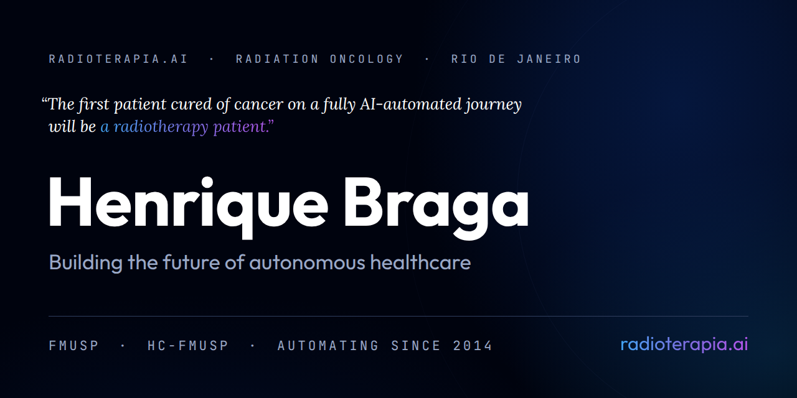
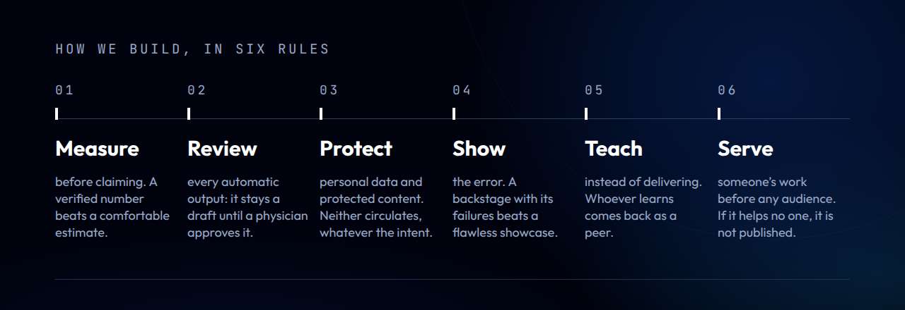

<!--
  README do perfil github.com/radioterapia-ai.

  As imagens saem de img/fonte/*.html pelo img/fonte/gerar.py, no sistema
  Nocturne: o mesmo do PhotoID RT, do Workstation Kit e da Local Suite.
  Não edite os PNG à mão: edite o HTML e rode o gerador.

  Só entra link PÚBLICO. Projeto sem página pública aparece pelo nome, sem
  link, até abrir: link que dá 404 para o visitante parece projeto abandonado.

  O tom é o que o autor pediu em 02/10/2026: animado, sem frase negativa e sem
  falar de responsabilidade no corpo. O alerta de uso clínico mora no rodapé.
-->

  

I'm **Henrique Faria Braga**, a radiation oncologist in Rio de Janeiro. Since
2014 I have been building automation for the operational and managerial work of
radiation therapy: medical records, billing, time-out, positioning photos,
protocols, transcription, contouring. It is the repetitive work that eats up a
department's week, and here you will find the automations that **get it done
even faster**.

My work is building the bridge between the technology that already exists and
the everyday user, with **friendly interfaces that are easy to use**. Under the
hood run open-source models and weights; on the surface, a screen that anyone
in the department can use.

These projects were born inside the clinic, long before any website. Now I am
polishing them to share through **[radioterapia.ai](https://radioterapia.ai)**,
a hub where builders list their projects and share what they have learned, and
I am putting mine up first to give it a **jump start**. Join the builders.

## What I build

  

### Web · AI-first, at [radioterapia.ai](https://radioterapia.ai)

- **Skills** that automate medical records, consent forms and insurance
  justifications, and a dedicated module of skills for patient interactions.
- **Agents** that simulate medical interactions: peer review and tumor boards.
- **Dose-constraint selection** for treatment planning.
- **A pricing agent** with radiotherapy market benchmarks.
- **Transcription engines** that turn consultation audio into medical text.
- **Realistic image generation** from curated prompts.
- **Slides with a human touch**: presentations without an AI look, from LLM
  content rendered to `.pptx` with Python
  ([Fábrica de Slides](https://huggingface.co/spaces/Radioterapia-AI/Fabrica_de_Slides)).

Webapps that talk to an LLM:

| Webapp | What it does |
|---|---|
| **ScoreHub RT** | Dozens of clinical scores and classifications, with a chat to discuss the case with a specialist identity, through the API of a reasoning LLM. |
| **DoseMaster AI-Quiz** | Questions and answers built on pedagogy and medical education in radiotherapy, for physicians, physicists, radiation therapists and dosimetrists, with a specialist-teacher identity through the API. |
| **DeFace RT** | DICOM anonymization of the header and of the anatomical face, so that a 3D reconstruction cannot be used for facial recognition. Four different algorithms. |
| **MiyAgi Diagram Master** | Flowchart automation. *Under construction.* |

### Local · on the clinic's own workstation

The **Local Suite**, for Windows:

| App | What it does |
|---|---|
| **ContourLab** | Anatomical segmentation and auto-contouring, for education, built on open-source weights and models. |
| **3D Printed Bolus** | Bolus for 3D printing, exported as STL. |
| **3D Reconstructions** | Anatomy in 3D, in the browser, for study. |
| **Nidus RT** | Simulates the reconstruction of arteriovenous malformations from CT angiography and MR angiography. |
| **DicomBridge** | Prepares and decompresses DICOM images for import into treatment planning systems. |
| **Elastic RT** | Shows deformable (elastic) image registration algorithms at work. |

And outside the suite:

| Project | What it does |
|---|---|
| **Scan-to-Text** | Turns scanned PDFs into text with OCR and Docling, ready for the physician to use in the consultation. |
| **[Workstation Kit](https://github.com/radioterapia-ai/workstation-kit)** | Diagnoses, cleans and optimises the open Windows session. One PowerShell file, no installer, no administrator. |
| **Portal Prescrição Eletrônica** | My first project: VBA automation of medical records and billing, built in 2014 for Hospital Heliópolis, in São Paulo, and **in use to this day**. |
| **Portal Ficha Técnica** | VBA automation that fills in the technical sheets for radiotherapy treatment. |

### Android

| App | What it does |
|---|---|
| **[PhotoID RT](https://github.com/radioterapia-ai/photoid-rt)** | Positioning photo documentation and the Time-Out sheet, on tablets inside the simulation room and at the machine. ID labels are read on the device. [Latest APK](https://github.com/radioterapia-ai/photoid-rt/releases/latest). |

### Hugging Face · where the engines live

Hugging Face hosts our engines and their dependencies. The web apps call them
through the Hugging Face API, and they are open source too, all published at
**[huggingface.co/Radioterapia-AI](https://huggingface.co/Radioterapia-AI)**,
among them [POP de Elite](https://huggingface.co/spaces/Radioterapia-AI/POP)
and [Fábrica de Slides](https://huggingface.co/spaces/Radioterapia-AI/Fabrica_de_Slides).

## How we build

  

## Curriculum

<table>
  <tr><td><b>Medicine</b></td><td>Faculdade de Medicina da Universidade de São Paulo (FMUSP)</td></tr>
  <tr><td><b>Residencies</b></td><td>Internal Medicine and Radiation Oncology, Hospital das Clínicas da FMUSP</td></tr>
  <tr><td><b>Board certification</b></td><td>Radiation Oncology, Sociedade Brasileira de Radioterapia</td></tr>
  <tr><td><b>Training abroad</b></td><td>The Johns Hopkins Hospital, Baltimore</td></tr>
  <tr><td><b>Today</b></td><td>Head of the Radiation Therapy team at Rede Américas · Medical Coordinator of Oncology at Centro Médico Samaritano Barra da Tijuca, Rio de Janeiro</td></tr>
  <tr><td><b>Building</b></td><td>Automating radiation therapy since 2014: from Portal Prescrição Eletrônica, at Hospital Heliópolis, to every project on this page</td></tr>
  <tr><td><b>Stack</b></td><td>Python · Kotlin (Android) · PowerShell · VBA · JavaScript · DICOM-RT · Varian Eclipse and ARIA</td></tr>
  <tr><td><b>Registrations</b></td><td>CREMESP 129263 · CREMERJ 52-111804-8 · RQE-SP 54873 · RQE-RJ 331440 · CNEN CB-8319</td></tr>
</table>

## Get to know my work

<table>
  <tr><td><b>Sites</b></td><td><a href="https://radioterapia.ai">radioterapia.ai</a>, the hub of the AI projects · <a href="https://drhenriquebraga.com.br/">drhenriquebraga.com.br</a></td></tr>
  <tr><td><b>Instagram</b></td><td><a href="https://www.instagram.com/radioterapiabr/">@radioterapiabr</a> · <a href="https://www.instagram.com/radioterapia.ai/">@radioterapia.ai</a> · <a href="https://www.instagram.com/podirradiar/">@podirradiar</a></td></tr>
  <tr><td><b>X</b></td><td><a href="https://x.com/radioterapiabr">@radioterapiabr</a></td></tr>
  <tr><td><b>YouTube</b></td><td><a href="https://www.youtube.com/@podirradiar">@podirradiar</a>: full episodes of the AI-generated podcast, built in NotebookLM from prompts curated by Dr. Henrique Braga</td></tr>
  <tr><td><b>LinkedIn</b></td><td><a href="https://www.linkedin.com/in/henriquefbraga/">Henrique Braga</a></td></tr>
  <tr><td><b>Hugging Face</b></td><td><a href="https://huggingface.co/Radioterapia-AI">Radioterapia-AI</a>, the engines, open source</td></tr>
</table>

<b>Em português</b>

 

> *“O primeiro paciente curado de câncer numa jornada totalmente automatizada por IA será um paciente de radioterapia.”*

Sou **Henrique Faria Braga**, radioterapeuta no Rio de Janeiro. Desde 2014
construo automação para o trabalho operacional e gerencial da radioterapia:
prontuário, faturamento, time-out, fotos de posicionamento, protocolos,
transcrição, contorno. É o trabalho repetitivo que consome a semana de um
serviço, **e agora tem aqui automações para executá-lo ainda mais rápido!**

Meu trabalho é fazer a ponte entre as tecnologias disponíveis e o usuário
comum, com **interfaces amigáveis e de fácil interação**. Por baixo, modelos e
pesos de código aberto; na frente, uma tela que qualquer pessoa do serviço
consegue usar.

Os projetos nasceram dentro da clínica, antes de qualquer site. Agora estão
sendo aprimorados para serem divulgados pelo
**[radioterapia.ai](https://radioterapia.ai)**, o hub de compartilhamento de
experiências que lista projetos de construtores, e estou subindo os meus
primeiro, para dar o impulso inicial. Junte-se aos construtores.

- **Web, AI-first, no radioterapia.ai:** skills para prontuário, termos de consentimento, justificativas para convênios e interações com pacientes; agentes que simulam peer review e tumor boards; seleção de constraints para planejamento; agente de precificação com benchmarks de mercado; motores de transcrição de consultas em texto médico; geração de imagens realistas com prompt curado; slides com toque humano. E os webapps **ScoreHub RT**, **DoseMaster AI-Quiz**, **DeFace RT** e **MiyAgi Diagram Master**.
- **Local Suite, para Windows:** ContourLab, 3D Printed Bolus, Reconstruções 3D, Nidus RT, DicomBridge e Elastic RT. Fora dela: Scan-to-Text, [Workstation Kit](https://github.com/radioterapia-ai/workstation-kit), **Portal Prescrição Eletrônica** (meu primeiro projeto, de 2014, no Hospital Heliópolis, em uso até hoje) e Portal Ficha Técnica.
- **Android:** [PhotoID RT](https://github.com/radioterapia-ai/photoid-rt).
- **Hugging Face:** hospeda nossos motores e dependências, chamados pela API do HF e de código aberto, em [huggingface.co/Radioterapia-AI](https://huggingface.co/Radioterapia-AI).

**Formação.** Medicina na FMUSP; residências em Clínica Médica e Radioterapia
no Hospital das Clínicas da FMUSP; título de especialista em Radioterapia pela
Sociedade Brasileira de Radioterapia; estágio no The Johns Hopkins Hospital, em
Baltimore.

**Hoje.** Chefe da equipe de Radioterapia da Rede Américas e Coordenador Médico
de Oncologia do Centro Médico Samaritano Barra da Tijuca, no Rio de Janeiro.

CREMESP 129263 · CREMERJ 52-111804-8 · RQE-SP 54873 · RQE-RJ 331440 · CNEN CB-8319

---

  <b>radioterapia.ai</b> · Inteligência além das fronteiras da saúde 
  Teaching and research tools, not medical devices: nothing here is validated for clinical use, and every automatic output is a draft for professional review. 
  Ferramentas de ensino e pesquisa, não dispositivos médicos: nada aqui é validado para uso clínico, e toda saída automática é rascunho para revisão profissional.

