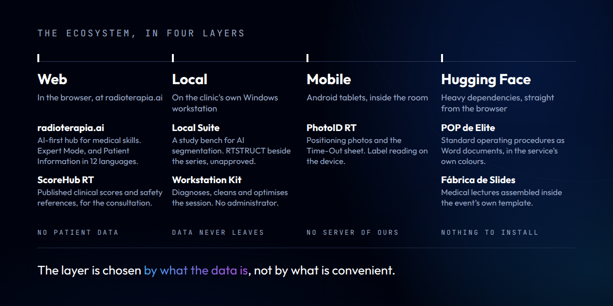

<!--
  README do perfil github.com/radioterapia-ai.

  As imagens saem de img/fonte/*.html pelo img/fonte/gerar.py, no sistema
  Nocturne: o mesmo do PhotoID RT, do Workstation Kit e da Local Suite.
  Não edite os PNG à mão: edite o HTML e rode o gerador.

  Só entra link PÚBLICO. Repositório privado aparece pelo nome, sem link,
  até abrir: link que dá 404 para o visitante parece projeto abandonado.
-->

  

I'm **Henrique Faria Braga**, a radiation oncologist in Rio de Janeiro. For more
than ten years I have been building automation for the operational and
managerial work of radiation therapy: time-out, positioning photos, protocols,
transcription, contouring. It is the repetitive work that consumes a
department's week, and that **nobody measures**.

Since 2026 that work has a name, **[Radioterapia.AI](https://radioterapia.ai)**,
and its code is published under the Apache License 2.0, so that other services
can download it, modify it and adapt it to their own research. Not to sell
software: to show how it is built. **Join the builders.**

> **Support tools, not medical devices.** Nothing published here is validated
> for clinical use. Every automatic output is a draft, and reviewing it is a
> physician's act.

## What I build

  

The four layers share a name and a clinical posture, not a codebase. A tool
that never sees patient data lives in the browser, where nobody has to install
anything; a tool that does runs **where the data already lives**. ContourLab
shows the rule at work: it used to run on Hugging Face, and it moved to the
clinic's own workstation as the Local Suite, because auto-contouring reads
patient images. The capability did not improve when it moved; the place did.

| | Project | What it does |
|---|---|---|
| **Mobile** | [PhotoID RT](https://github.com/radioterapia-ai/photoid-rt) | Positioning photo documentation on Android tablets inside the room, with the Time-Out sheet. ID labels are read on the device, and nothing leaves it unless the service configures a destination. [Latest APK](https://github.com/radioterapia-ai/photoid-rt/releases/latest). |
| **Local** | [Workstation Kit](https://github.com/radioterapia-ai/workstation-kit) | Diagnoses, cleans and optimises the open Windows session. One PowerShell file, no installer, no administrator. |
| **Local** | Local Suite | A study bench for AI segmentation. It runs third-party models over a CT on the department's own workstation and writes an RTSTRUCT beside the series, as an unapproved suggestion to review in the planning system. *The repository opens at launch.* |
| **Web** | [radioterapia.ai](https://radioterapia.ai) | An AI-first hub for medical skills, applications and community contributions. Expert Mode for professionals, Patient Information in 12 languages. |
| **Web** | ScoreHub RT | Published clinical scores, reproduced faithfully and driven by JSON, plus safety references: cardiac implantable devices, re-irradiation, drug–radiotherapy intervals and dose constraints. *In preparation for radioterapia.ai.* |
| **Hugging Face** | [POP de Elite](https://huggingface.co/spaces/Radioterapia-AI/POP) | Standard operating procedures laid out as Word documents, with checklists, flowcharts and scales, in the service's own colours and logo. |
| **Hugging Face** | [Fábrica de Slides](https://huggingface.co/spaces/Radioterapia-AI/Fabrica_de_Slides) | Medical lectures assembled inside the event's own template. |

## What is ours, and what is not

**We do not train the models.** The models that recognise anatomy or read a
label belong to third parties (TotalSegmentator, NVIDIA NV-Segment-CT, Google
ML Kit, among others), and every project credits each one with author, licence
and version. What we build is the **accessibility layer**: the interface that
puts an existing capability within reach of the people who work in the room,
without Python, command lines or administrator rights.

Making something reachable is not a neutral act: it is what turns a research
model into something used in the clinic. That is why the warnings, the drafts
and the human in the loop are **our responsibility**.

**Two regimes, the same code.** Published code is teaching and research
material, and whoever downloads, modifies and deploys it answers for their own
build. An institution's own build, with documented validation, is in-house
software as a medical device, under that institution's responsibility. The
precedent is TotalSegmentator itself: it declares that it is not a medical
device, and it is a certified component inside FDA-cleared products.

## How we build

  

## Curriculum

<table>
  <tr><td><b>Medicine</b></td><td>Faculdade de Medicina da Universidade de São Paulo (FMUSP)</td></tr>
  <tr><td><b>Residencies</b></td><td>Internal Medicine and Radiation Oncology, Hospital das Clínicas da FMUSP</td></tr>
  <tr><td><b>Board certification</b></td><td>Radiation Oncology, Sociedade Brasileira de Radioterapia</td></tr>
  <tr><td><b>Training abroad</b></td><td>The Johns Hopkins Hospital, Baltimore</td></tr>
  <tr><td><b>Today</b></td><td>Head of the Radiation Therapy team at Rede Américas · Medical Coordinator of Oncology at Centro Médico Samaritano Barra da Tijuca, Rio de Janeiro</td></tr>
  <tr><td><b>Memberships</b></td><td>Sociedade Brasileira de Radioterapia · American Society for Radiation Oncology (ASTRO)</td></tr>
  <tr><td><b>Building</b></td><td>More than ten years automating the operational and managerial workflows of radiation therapy. Originator of Radioterapia.AI</td></tr>
  <tr><td><b>Stack</b></td><td>Kotlin (Android) · Python · PowerShell · JavaScript · DICOM-RT · Varian Eclipse and ARIA</td></tr>
  <tr><td><b>Registrations</b></td><td>CREMESP 129263 · CREMERJ 52-111804-8 · RQE-SP 54873 · RQE-RJ 331440 · CNEN CB-8319</td></tr>
</table>

## Who builds with me

Radioterapia.AI is built by two people. I take **Medical Skills & Apps**.
**Fís. Lucas Brito** ([@lucasbritocFis](https://github.com/lucasbritocFis) ·
[LinkedIn](https://www.linkedin.com/in/lucassbrito/)), co-founder, takes
**Physics Scripts & Architecture**: a clinical medical physicist and software
developer, responsible for the platform's technical architecture and AI
tooling. He registered the domain and runs the infrastructure that put the web
ecosystem online.

## Elsewhere

<table>
  <tr><td><b>Radioterapia.AI</b></td><td><a href="https://radioterapia.ai">radioterapia.ai</a> · <a href="https://radioterapia.ai/about">about</a> · <a href="https://huggingface.co/Radioterapia-AI">Hugging Face</a></td></tr>
  <tr><td><b>Personal site</b></td><td><a href="https://drhenriquebraga.com.br/">drhenriquebraga.com.br</a></td></tr>
  <tr><td><b>LinkedIn</b></td><td><a href="https://www.linkedin.com/in/henriquefbraga/">Henrique Braga</a></td></tr>
  <tr><td><b>Instagram</b></td><td><a href="https://www.instagram.com/radioterapiabr/">@radioterapiabr</a>, clinical and institutional · <a href="https://www.instagram.com/radioterapia.ai/">@radioterapia.ai</a>, how it is built · <a href="https://www.instagram.com/podirradiar/">@podirradiar</a>, the oncology podcast</td></tr>
</table>

Every repository carries a `CITATION.cff`, and GitHub renders a **Cite this
repository** button from it. If this work is useful in yours, a citation is
appreciated: it is asked for, not required.

<b>Em português</b>

 

Sou **Henrique Faria Braga**, radioterapeuta no Rio de Janeiro. Há mais de dez
anos construo automação para o trabalho operacional e gerencial da
radioterapia: time-out, fotos de posicionamento, protocolos, transcrição,
contorno. É o trabalho repetitivo que consome a semana de um serviço, e que
**ninguém mede**.

Desde 2026 esse trabalho tem nome, **[Radioterapia.AI](https://radioterapia.ai)**,
e o código é publicado sob a Apache 2.0, para que outros serviços baixem,
modifiquem e adaptem às próprias pesquisas. Não é para vender software: é para
mostrar como se constrói. **Junte-se aos construtores.**

> **Ferramentas de apoio, não dispositivos médicos.** Nada publicado aqui é
> validado para uso clínico. Toda saída automática é rascunho, e revisá-la é
> ato médico.

O ecossistema tem quatro camadas, e **a camada é escolhida pelo que o dado é**,
não pelo que é conveniente:

- **Móvel**, no tablet dentro da sala: [PhotoID RT](https://github.com/radioterapia-ai/photoid-rt), a documentação fotográfica do posicionamento, com a folha de Time-Out.
- **Local**, na estação da própria clínica, porque o dado não pode sair: a Local Suite (bancada de estudo de segmentação por IA, com o repositório abrindo no lançamento) e o [Workstation Kit](https://github.com/radioterapia-ai/workstation-kit).
- **Web**, no navegador, sem dado de paciente: o [radioterapia.ai](https://radioterapia.ai) e o ScoreHub RT, de escores clínicos publicados.
- **Hugging Face**, o que tem dependência pesada, direto do navegador: [POP de Elite](https://huggingface.co/spaces/Radioterapia-AI/POP) e [Fábrica de Slides](https://huggingface.co/spaces/Radioterapia-AI/Fabrica_de_Slides).

**Não treinamos os modelos: tornamos acessível o que já existia.** Cada
componente de terceiros é creditado com autor, licença e versão.

**Formação.** Medicina na FMUSP; residências em Clínica Médica e Radioterapia
no Hospital das Clínicas da FMUSP; título de especialista em Radioterapia pela
Sociedade Brasileira de Radioterapia; estágio no The Johns Hopkins Hospital, em
Baltimore. Membro da SBRT e da ASTRO.

**Hoje.** Chefe da equipe de Radioterapia da Rede Américas e Coordenador Médico
de Oncologia do Centro Médico Samaritano Barra da Tijuca, no Rio de Janeiro.

CREMESP 129263 · CREMERJ 52-111804-8 · RQE-SP 54873 · RQE-RJ 331440 · CNEN CB-8319

---

  <b>Radioterapia.AI</b> · Inteligência além das fronteiras da saúde 
  Radioterapia.AI is a trade name and a website, not a legal entity. The names and logos are not licensed with the code.

